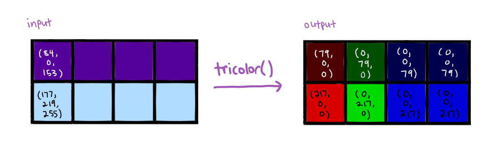
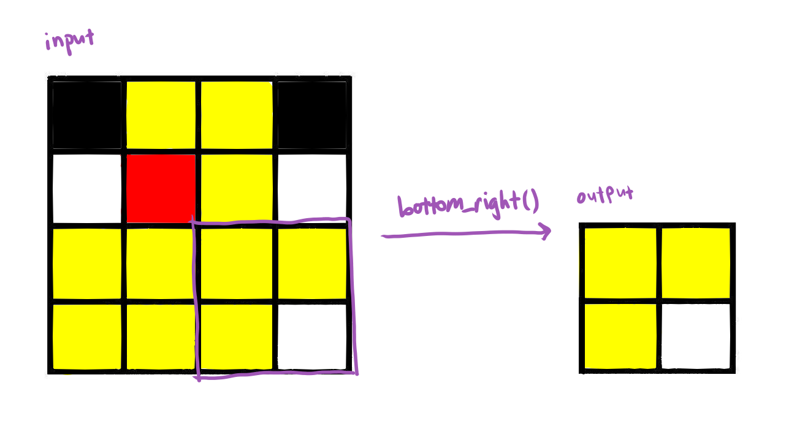
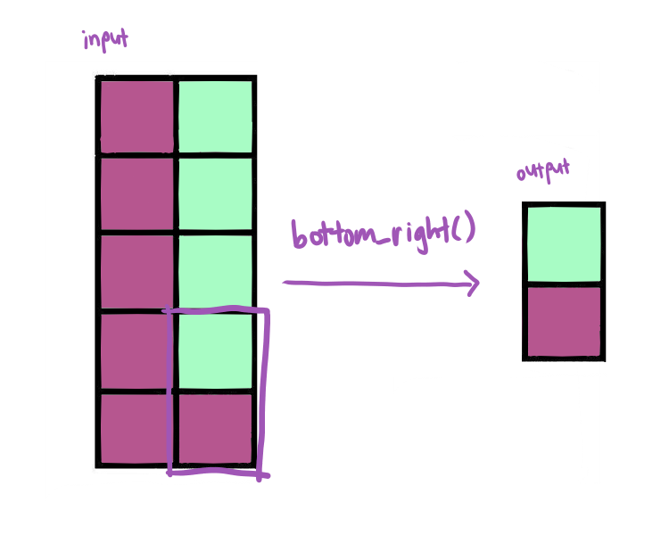

---
layout: page
title: "UCSD CSE8A W21 – PA9 (Programming Assessment)"
doodle: "/doodle.png"
--- 

# PA9 (Programming Assessment)

**Due Tuesday, March 16, 4pm Pacific Time**

This assessment is to be completed entirely on your own. You can ask
_private_ questions about the assignment on Edstem, but it's likely that we
won't give detailed answers and won't help you write or debug your program.
The intent of this assessment is to give a grade to your understanding of the
material from the course so far.

You can use any course resources, videos, Google searches, and so on to
complete this assessment. You _cannot_ communicate with anyone else or get
staff help to complete it. You can ask staff questions about making your
video or submission logistics, but they have been instructed to not help with
your program.

You will also complete a video screencast demonstrating part of the PA for
grading, which is detailed at the end of this description.

## Programming Tasks


### Tricolor

Write a function `tricolor` that takes an image represented as a 2D list of tuples and changes it so the
leftmost third is in **redscale**, the middle third in **greenscale**, and
the rightmost third in **bluescale**. The function should return the
reference to the original image. The **redscale** of a pixel is a pixel with the average of the original pixels' values in the red component, and 0 in each of the green and blue components.

If the image's width isn't an even multiple of 3, treat the “leftmost third”
as the first `width // 3` columns, the “middle third” as the second `width //
3` columns, and the remainder as the rightmost third.

For example, our course logo in tricolor would be:


Here's a smaller example:



Write appropriate assert tests to demonstrate that your program works as
expected. We've provided a small number of autograder tests to help you, but
they don't comprehensively cover the behavior of the function, which you are
responsible for testing thoroughly.

### Bottom-right

Write a function `bottom_right` that takes an image represented as a 2D list of tuples, and produces a _new_
image that's just the bottom right quadrant of the image. If the height or
width are odd, round down. For example, the bottom right of a 3 height, 5
width image has height 1 and width 2.

Here are two examples of getting the bottom right of an image:




Write appropriate assert tests to demonstrate that your program works as
expected. We've provided a small number of autograder tests to help you, but
they don't comprehensively cover the behavior of the function, which you are
responsible for testing thoroughly.


### Population density

Write a function `most_dense_bigger_than` that takes a list of dictionaries
`countries` and a number `area`. The list of dictionaries represents data
about countries (described below), and the `area` parameter represents a
square mileage. The function returns the **name** of the country that is the
**most dense** in terms of population out of the countries that have at least
`area` land area. We define the population density of a country as its
**population** divided by its **land area**.

Assume there are no ties, and the list contains at least one element.

<div class='sidenote'>This data is from <a href="https://en.wikipedia.org/wiki/List_of_countries_and_dependencies_by_population_density">Wikipedia</a>.</div>

An example of a list of dictionaries representing data about countries is:

```
countries = [
  { 'name': "USA", 'population': 330000000, 'area': 3800000},
  { 'name': "China", 'population': 1400000000, 'area': 3700000},
  { 'name': "Tuvalu", 'population': 10300, 'area': 10 }
]
```

We would expect that `most_dense_bigger_than(countries, 100)` would return
`"China"`, and `most_dense_bigger_than(countries, 0)` would return
`"Tuvalu"`. Your function should work for any input list of countries.

### Book Complexities

Write a function `book_complexity` that takes a dictionary where the keys are strings (representing titles of books) and the values are lists of strings (representing the text of a book).

It should produce a new dictionary with the same keys, where each value is the average (mean) of the lengths of the strings in the corresponding list (a crude measure of the complexity of a book). Assume all the lists have at least one element.

Example:

```
books = {
  'harry potter': ['there', 'once', 'was', 'a', 'boy'],
  'a tale of two cities': ['it', 'was', 'the', 'best']
}
assert book_complexity(books) == { 'harry-potter': 16 / 5, 'a tale of two cities': 12 / 4 }
```


## Video Tasks

You must also record and upload a screencast that demonstrates that you
understand each of the programs you wrote.

You should perform each of the following tasks in the recording:

1. Show your student ID with your face showing (so we can verify that it is
you).
1. With your code file showing, choose one of the image functions `bottom_right` or `tricolor`. Show an
example of calling the function at interactions with an image that has at least 2 rows and 2 columns, storing the result in a new variable. Describe the _memory
diagram_ of the stack and heap before and after calling the function, including any relevant global variable. ([Example Video](https://drive.google.com/drive/u/0/folders/1T30xpNSRkQqease-HMcoN3YeVe0ayVkE)).
2. With your code file showing, choose a loop, or a use of `map`/`filter` (or another list function like map or filter, if you used that) in your implementation of
`most_dense_greater_than` or in `book_complexity`. Show an example of calling
that function at interactions, and then show trace of the part you picked for the input you used.

Your video should be no longer than 8 minutes.

## Submission

Submit your program via Ed. Make sure to click ✔️Mark on all slides before the deadline.

Submit your video via this Google Form:

[https://docs.google.com/forms/d/e/1FAIpQLSde_ahCaz2weOR12pnj-4QtPOAuhk4Msc0j2fiz8DVDSIx4HQ/viewform](https://docs.google.com/forms/d/e/1FAIpQLSde_ahCaz2weOR12pnj-4QtPOAuhk4Msc0j2fiz8DVDSIx4HQ/viewform)


