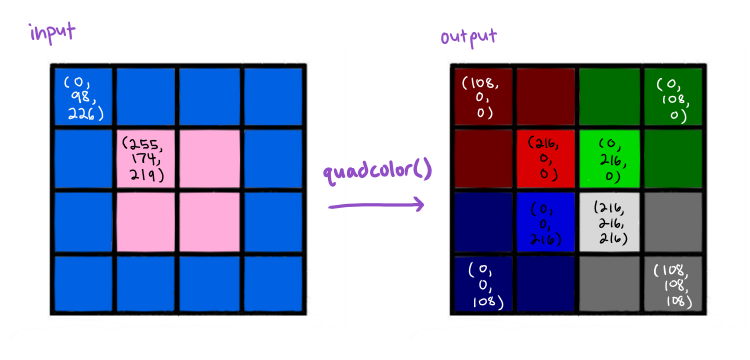
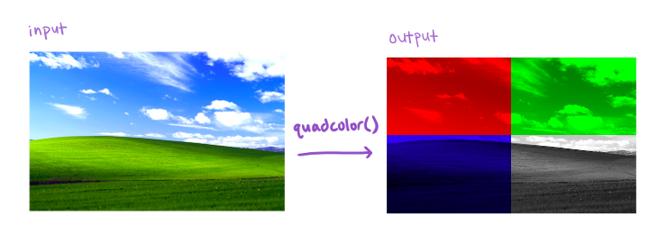

# Final PA (Programming Assessment)

**Due Thursday, March 18 at 10pm Pacific Time**

This assessment is to be completed entirely on your own. You can ask private questions about the assignment on EdsStem, but it’s likely that we won’t give detailed answers and won’t help you write or debug your program. The intent of this assessment is to give a grade to your understanding of the material from the course so far.

You can use any course resources, videos, Google searches, and so on to complete this assessment. You cannot communicate with anyone else, use a solution you did not write yourself, or get staff help to complete it. You can ask staff questions about making your video or submission logistics, but they have been instructed to not help with your program.

For example, you should not post about the assignment on web sites like CourseHero, or copy solutions from there.

You will also complete a video screencast demonstrating part of the PA for grading, which is detailed at the end of this description.

# Programming Tasks – Functions

For **all** programs below, we provide a small number of examples in the autograder and the description. This doesn't cover all relevant cases, so you are responsible for writing assert tests to thoroughly check your programs for correctness.

## `starts_with_vowel`

Write a function `starts_with_vowel` that takes a string and returns `True` if it starts with an English-language vowel in lower or uppercase (a, e, i, o, u, A, E, I, O, U), `False` otherwise.

```
assert starts_with_vowel("Does not start with a vowel") == False
```

## `progressive_tax`

Write a function `progressive_tax` that takes a number representing an income. If it's less than or equal to 40000, return 0.25 times the number. If it's over 40000, return 0.25 times the first 40000 **plus** 0.35 times the amount over 40000.

```
assert progressive_tax(40001) == 10000.35
```

## `long_first_words`

Write a function `long_first_words` that takes a list of strings (representing sentences) and returns a list of strings that are the _long first words_ of those sentences. We define the first word as the substring before the first space character `' '` in the string, or the whole string if there is no space character. We call the substring long if it is (strictly) over 5 characters in length.

```
sentences = [
  "This sentence starts with a short word",
  "Longer words can also start sentences",
  "Eureka!",
  "Hi!"]
assert long_first_words(sentences) == ["Longer", "Eureka!"]
```

## `quadcolor`

Write a function `quadcolor` that takes an image and changes it so that the top left quadrant is in redscale, the top right is in greenscale, the bottom left is in bluescale, and the bottom right is in grayscale. The function should return a reference to the original image.

For this question, the grayscale of a pixel is a pixel where each color component is the average (mean) of the original pixel's color components. For example, the grayscale of `(100, 11, 70)` is `(60, 60, 60)`.

If the image has an odd width or height, make the left half and/or top half smaller. For example, the quadcolor of an image with height 3 would have a single row of red/green pixels, and two rows of blue/gray pixels.

The scaled numbers should be truncated (rounded towards 0) so the values in the pixels are integers from 0-255.

```
example = [[(100, 10, 70), (100, 10, 70)], [(100, 10, 70), (100, 10, 70)]]
assert quadcolor(example) == [[(60, 0, 0), (0, 60, 0)], [(0, 0, 60), (60, 60, 60)]]
```




# Programming Task – Input

We provide a few interactive tests in the automated grader. They don't necessarily cover all cases, so you're responsible for thoroughly checking that your program works according to the description.

## `tally`

Write a program that continually prompts a user for a string of input with the prompt `"Enter a name (or nothing to stop):"`. If the user inputs an empty string, the program should print the name that they entered the most times, in this format:

```
Winner is <name> with <n> votes.
```

Where `<name>` is the name that was entered most, and `<n>` is the number of times that name was entered.

If there is a tie, or if no names were entered, the program should print

```
There was no winner.
```

Example:

```
$ python tally.py
Enter a name (or nothing to stop): Joe
Enter a name (or nothing to stop): Shad
Enter a name (or nothing to stop): Amy
Enter a name (or nothing to stop): Shad
Enter a name (or nothing to stop):
Winner is Shad with 2 votes.
```

# Video Tasks

1. Show a photo ID.
1. For `long_first_words`, show an example of calling the function at interactions with the provided example list. Provide a trace of a loop, a use of `map`, OR a use of `filter` in your implementation.
2. For `quadcolor`, show an example of calling the function at interactions with an image larger than 2x2, saving the result in a new variable. Then show a stack and heap diagram (a memory diagram) of the program before and after calling the function.

Your video should be no longer than 8 minutes.

# Submission

Submit your video here:

https://docs.google.com/forms/d/e/1FAIpQLSff8Rxb5wUJI6LfibMb3J3wQsOwM86F88ZZ706g5V5s1XPrYw/viewform

Make sure to click ✔️Mark on your code submission. There are two places to click Mark, one for the first four functions, and one for just `tally.py`.
